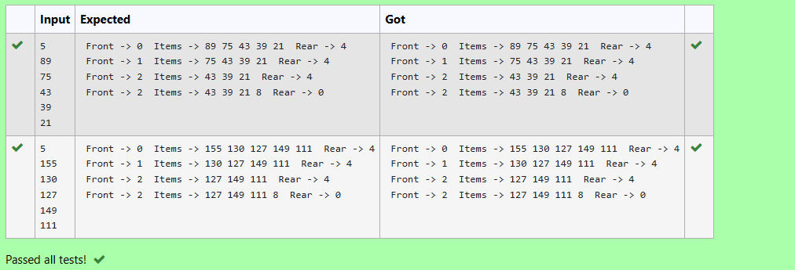

# Insert Element in Circular Queue after Two Dequeues

## Aim:
To write a C program to implement a circular queue and insert an element (8) after performing two dequeue operations on a filled circular queue.

## Algorithm:
Start

Initialize front = -1, rear = -1, and define SIZE = 5.

Define functions:

enQueue(int element) to insert elements following circular queue rules.

deQueue() to remove elements from the front.

display() to print the elements in the queue.

In main():

Input the number of elements to insert (m).

Input and insert m elements using enQueue.

Display the queue.

Perform deQueue() twice and display the queue after each.

Insert 8 using enQueue(8) and display the final queue.

End

## Program:
   ```
   /*#include <stdio.h>

#define SIZE 5

int items[SIZE];
int front = -1, rear = -1;
*/
int main() {
 
  int m,t,k;
  //m is the number of elements to be inserted,k is the array index,t is the element to be inserted
  scanf("%d",&m);
  for (k=0;k<SIZE;k++){
      scanf("%d",&t);
      enQueue(t);
  }
  display();
  deQueue();
display();
  deQueue();
display();
enQueue(8);
display();
}


   ```
## Output:

## Result:
Thus, the C program to insert element 8 into a filled circular queue after two dequeue operations was successfully implemented and executed.

