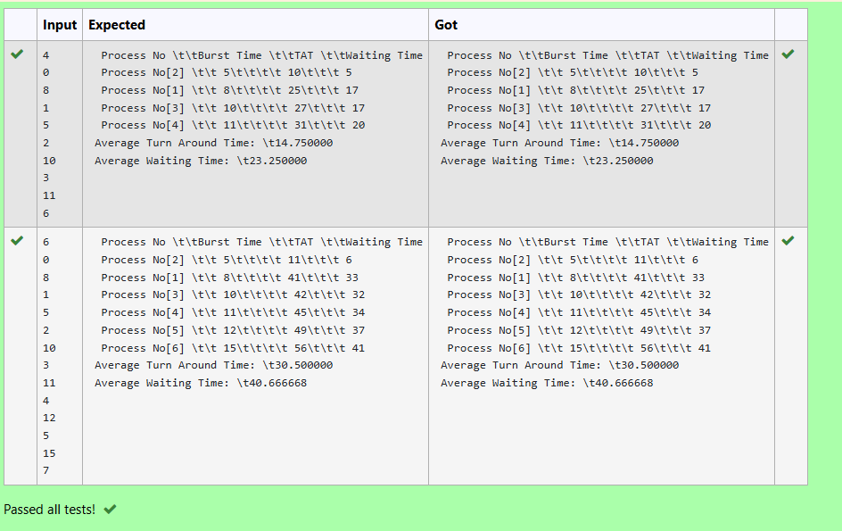

# Round Robin Scheduling Algorithm - Calculation of Waiting Time and Turnaround Time

## Aim:
To implement the Round Robin Scheduling algorithm in C to calculate the Waiting Time (WT) and Turnaround Time (TAT) for each process based on the given Arrival Time (AT) and Burst Time (BT).

## Algorithm:
Start

Input the number of processes NOP.

### For each process:

Input Arrival Time (AT[i])

Input Burst Time (BT[i]) and store it in a temporary array temp[i].

Input Time Quantum (quant).

Initialize sum = 0 and iterate until all processes are completed (y != 0).

### For each process:

If the remaining burst time is less than or equal to time quantum, execute and calculate completion time.

If more, reduce the remaining time by quantum and increase sum by quantum.

### Once a process finishes, calculate and display:

Turnaround Time = Completion Time - Arrival Time

Waiting Time = Turnaround Time - Burst Time

Update total WT and TAT.

Calculate and display average WT and TAT.

End

## Program:
```
#include<stdio.h>  

int main()  
{  
    // initlialize the variable name  
    int i, NOP, sum=0,count=0, y, quant, wt=0, tat=0, at[10], bt[10], temp[10];  
    float avg_wt, avg_tat;  
   // printf(" Total number of process in the system: ");  
    scanf("%d", &NOP);  
    y = NOP; // Assign the number of process to variable y  
  
// Use for loop to enter the details of the process like Arrival time and the Burst Time  
for(i=0; i<NOP; i++)  
{  
//printf("\n Enter the Arrival and Burst time of the Process[%d]\n", i+1);  
//printf(" Arrival time is: \t");  // Accept arrival time  
scanf("%d", &at[i]);  
//printf(" \nBurst time is: \t"); // Accept the Burst time  
scanf("%d", &bt[i]);  
temp[i] = bt[i]; // store the burst time in temp array  
}  
// Accept the Time quantum  
//printf("Enter the Time Quantum for the process: \t");  
scanf("%d", &quant);  
// Display the process No, burst time, Turn Around Time and the waiting time  
printf("  Process No \t\tBurst Time \t\tTAT \t\tWaiting Time ");  

for(sum=0, i = 0; y!=0; )  
{  
if(temp[i] <= quant && temp[i] > 0) // define the conditions   
{  
    sum = sum + temp[i];  
    temp[i] = 0;  
    count=1;  
    }     
    else if(temp[i] > 0)  
    {  
        temp[i] = temp[i] - quant;  
        sum = sum + quant;    
    }  
    if(temp[i]==0 && count==1)  
    {  
        y--; //decrement the process no.  
        printf("\n  Process No[%d] \t\t %d\t\t\t\t %d\t\t\t %d", i+1, bt[i], sum-at[i], sum-at[i]-bt[i]);  
        wt = wt+sum-at[i]-bt[i];  
        tat = tat+sum-at[i];  
        count =0;     
    }  
    if(i==NOP-1)  
    {  
        i=0;  
    }  
    else if(at[i+1]<=sum)  
    {  
        i++;  
    }  
    else  
    {  
        i=0;  
    }  
}  
 
avg_wt = wt * 1.0/NOP;  
avg_tat = tat * 1.0/NOP;  
printf("\n Average Turn Around Time: \t%f", avg_wt);  
printf("\n Average Waiting Time: \t%f", avg_tat);  

}  
 


```
## Output:

## Result:
The C program successfully computes and displays the Waiting Time and Turnaround Time for each process using the Round Robin Scheduling Algorithm along with their averages.